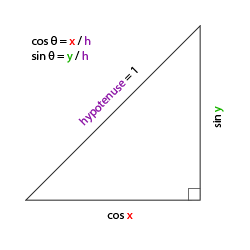

# aura.cpp结构

## 1. glfw初始化
## 2. 设置窗口
## 3. glad初始化
## 4. OpenGL配置
## 5. Render Loop


## 处理输入
void processInput(GLFWwindow* window);  
在render loop中加入该函数，从而在每次循环时处理按键响应。


# shader类
## Shader(const char* vertexPath, const char* fragmentPath)
构造函数  
1. 根据参数指定的文件地址获取对应vertex shader和fragment shader，加载到cstr中。
2. 对shader进行编译，创建program链接。
## use()
启用program

## setXXX()  
设置uniform值


# glActiveTexture和glBindTexture  
+ 在openGL中，存在一系列的texture unit，通过 glActiveTexture激活当前的texture unit，默认的unit是0。而当前的texture unit中存在多个texture target，例如GL_TEXTURE_2D, GL_TEXTURE_CUBEMAP。  
+ 通过glBindTexture将一个texture object绑定到当前激活的texture unit的texture target上。然后通过glTexImage2D, glTexParameteri等函数改变texture object的状态。
+ 创建texture object的时候需要指定texture unit吗？  
并不需要，无论当前是哪个texture unit，不影响创建texture object。创建好的texture object可以绑定到其他texture unit的texture target上使用。  
+ 创建texture object后(glCreateTexture)，第一次调用glBindTexture，决定了texture object的类型，比如调用的是glBindTexture(GL_TEXTURE_2D)，那么这个texture object就是一个2d texture，其内部状态被初始化为2d texture的状态，它不能再被bind到其他类型的texture target上，否则会产生运行时错误。  
+ 什么时候需要关心texture unit?  
当使用多重纹理的时候，也就是说在shader里面要同时使用多于一个sampler的时候。通过glUniform1i将texture unit传给sampler，让sampler知道应该去哪个texture unit中获取texture object，那么应该获取哪个texture target指向的texture object呢？这就要看sampler的类型了。比如sampler2D，就会获取sampler被指向的texture unit中的GL_TEXTURE_2D texture targert。  
+ 总结：  
openGL中纹理的状态分为texture unit和texture object包含的状态。texture unit的状态包括当前激活的unit，每个unit下面的各个target分别指向哪些texture object。texture object的状态包含type, texParam, format等等。什么时候需要调用glActiveTexture以及glBindTexture就要看状态是否会改变。对于shader来说，他可以访问所有的texture unit中指定的texture object。只要你告诉他每个sampler使用哪个unit就行。如果每个unit的内容指定后不需要改变，则即便shader使用了多个sampler也不需要来回切换unit的状态。当然更常见的是渲染完一个pass后，需要改变当前texture unit中某target中的texture object，也就是需要换贴图了。那么标准的操作就是先glActiveTexture，然后glBindTexture。当然如果你只使用unit0，则不需要调用glActiveTexture。

# C++输入输出  
   
 C++库中流类的继承关系  
 
 图 1 中这些流类各自的功能分别为：
+ istream：常用于接收从键盘输入的数据；  
+ ostream：常用于将数据输出到屏幕上；  
+ ifstream：用于读取文件中的数据；  
+ ofstream：用于向文件中写入数据；  
+ iostream：继承自 istream 和 ostream 类，因为该类的功能兼两者于一身，既能用于输入，也能用于输出；  
+ fstream：兼 ifstream 和 ofstream 类功能于一身，既能读取文件中的数据，又能向文件中写入数据。  


# camera.h  
属性:  
相机属性: 
position, front, up, right  
世界坐标系下向上方向:WorldUp  
欧拉角:Yaw, Pitch  
其他相机选项:MovementSpeed, MouseSensitivity, Zoom  
构造函数:
+ 向量构造函数
+ 标量构造函数 

成员函数:  
+ 键盘响应(方向, 时间)
+ 鼠标相应(水平位移, 竖直位移, 是否限制)
+ 滚动响应(位移):调整fov角度
+ 执行update


# 欧拉角转front向量  
欧拉角(Euler Angle)是可以表示3D空间中任何旋转的3个值，由莱昂哈德·欧拉(Leonhard Euler)在18世纪提出。一共有3种欧拉角：俯仰角(Pitch)、偏航角(Yaw)和滚转角(Roll)，下面的图片展示了它们的含义：  

  
即以front朝向z负方向,up朝向y正方向,right朝向x正方向为起始.  
  
  

获得:  
direction.y = sin(glm::radians(pitch));   
direction.x = cos(glm::radians(pitch));  
direction.z = cos(glm::radians(pitch));  

# mesh.h
属性: vertex数组,indices数组,texture数组  
构造函数: 初始化  
setupMesh: 设置VAO,VBO,EBO等缓存  
Draw: 纹理绑定, VAO绑定, 绘图.


递归访问全部node, 对于每个node中的mesh进行处理, 构造mesh对象.  
构造mesh对象的过程包括: vertex属性的存储, indice的存储, texture的存储.  
解析过程涉及到对上图scene结构的理解.  


# 深度测试笔记
## 如何启用深度测试?
glEnable(GL_DEPTH_TEST);  
## 在渲染循环过程中要注意清除深度缓存  
glClear(GL_COLOR_BUFFER_BIT | GL_DEPTH_BUFFER_BIT);  
## 如何禁用深度缓存的更新?  
glDepthMask(GL_FALSE);  
## 如何指定深度测试通过行为?  
glDepthFunc(GL_LESS);// GL_ALWAYS GL_NEVER GL_LESS GL_EQUAL GL_LEQUAL GL_GREATER GL_NOTEQUAL GL_GEQUAL  


# framebuffer  
## 如何使用framebuffer?  
 1. 创建一个framebuffer对象, 并绑定  
 ```cpp
 unsigned int framebuffer;
 glGenFramebuffers(1, &framebuffer);
 glBindFramebuffer(GL_FRAMEBUFFER, framebuffer);
 ```  
 2. 创建一个纹理, 附加到framebuffer上  
 ```cpp
 unsigned int texColorBuffer;
 glGenBuffer(1, &texColorBuffer);
 glBindTexture(GL_TEXTURE2D, texColorBuffer);
 glTexImage2D(GL_TEXTURE_2D, 0, GL_RGB, 800, 600, 0, GL_RGB, GL_UNSIGNED_BYTE, NULL);
glTexParameteri(GL_TEXTURE_2D, GL_TEXTURE_MIN_FILTER, GL_LINEAR );
glTexParameteri(GL_TEXTURE_2D, GL_TEXTURE_MAG_FILTER, GL_LINEAR);
glBindTexture(GL_TEXTURE_2D, 0);

// 将它附加到当前绑定的帧缓冲对象
glFramebufferTexture2D(GL_FRAMEBUFFER, GL_COLOR_ATTACHMENT0, GL_TEXTURE_2D, texColorBuffer, 0);  
 ```

# 高级GLSL  
## 内建变量  
gl_Position(out): 顶点着色器输出  
gl_PointSize(out): 如果以点的方式绘制, 该变量决定了点的大小, 在粒子系统中存在应用.  
gl_VertexID(in): 

gl_FragCoord(in): (x,y,z),其中x,y是屏幕空间坐标,z是深度值  
gl_FrontFacing(in): 该frag位置正面还是反面 bool类型  
gl_FragDepth(out): 修改该frag的深度值(会导致禁用提前深度测试)

## uniform缓冲  
类似于纹理的绑定, 把shader中多个uniform绑定在同一个绑定点上面, 然后将该绑定点与缓冲对象绑定, 这样只需要修改一次缓冲对象就可以将修改应用到多个uniform变量.  

# 几何着色器  
顶点着色器->几何着色器->片段着色器  
几何着色器的输入是图元, 输出也是图元: 比如可以对点进行处理, 变成三角形  


# 硬阴影的实现  
1. 从光源方向看向场景, 保留深度图, 生成shadow map.
2. 从相机方向看向场景, 在fragment shader中, 对于每一个fragment, 获得其在世界坐标系下的坐标, 变换到shadow map中查询深度值, 将shadow map中的深度值与该点到光源的距离进行比较, 可以判断该点是否被物体遮挡.  
